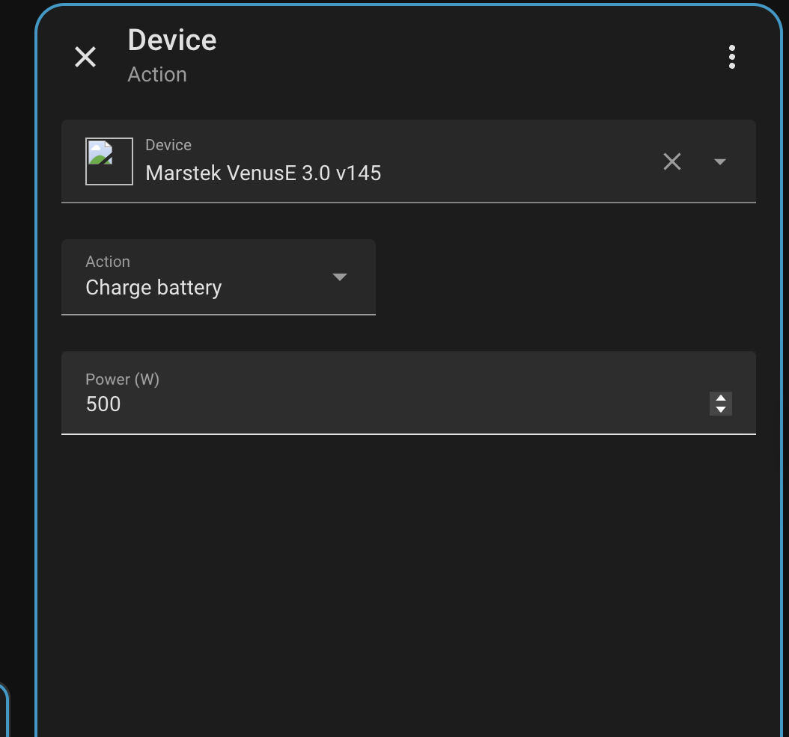

# Services

The integration exposes services for advanced control and automation.

> Tip: When automating control commands, prefer calling these services rather than trying to “poke” entity state.

All services target a device via `device_id` (select the Marstek device).

## `marstek.set_passive_mode`

Set passive mode with a target power and duration.

- `device_id` (required): target Marstek device
- `power` (required, W): negative = charge, positive = discharge
	- Input range is `-5000..5000`, but the effective limit is validated per device/model (and may depend on the **Socket limit** option).
- `duration` (optional, seconds): how long to keep passive mode active (default `3600`, range `0..86400`)


## `marstek.set_manual_schedule`

Configure one schedule slot (0–9).

- `device_id` (required): target Marstek device
- `schedule_slot` (optional): slot `0..9` (default `0`)
- `start_time` (required): start time
- `end_time` (required): end time
- `power` (required, W): negative = charge, positive = discharge
	- Input range is `-5000..5000`, but the effective limit is validated per device/model (and may depend on the **Socket limit** option).
- `days` (optional): list of weekday values (default all days)
	- Valid values: `mon`, `tue`, `wed`, `thu`, `fri`, `sat`, `sun`
- `enable` (optional): enable/disable this slot (default `true`)


## `marstek.set_manual_schedules`

Configure multiple schedules at once (YAML list).

- `device_id` (required): target Marstek device
- `schedules` (required): YAML list of schedule objects
	- Required per item: `schedule_slot`, `start_time`, `end_time`
	- Optional per item: `days`, `power`, `enable`
	- `start_time`/`end_time` must be strings in `HH:MM` format

### Example YAML (common patterns)

> Replace `YOUR_DEVICE_ID` with the device ID from the device selector in the UI.

#### What to paste into the **`schedules`** input field

In the Home Assistant service UI, the `schedules` field expects **just the YAML list**. Example:

```yaml
- schedule_slot: 0
	start_time: "10:00"
	end_time: "15:30"
	days: [mon, tue, wed, thu, fri]
	power: -2000
	enable: true
- schedule_slot: 1
	start_time: "18:00"
	end_time: "22:30"
	days: [mon, tue, wed, thu, fri]
	power: 1200
	enable: true
```

#### 1) Weekday daytime charging (solar/top-up) + evening discharge (peak shaving)

```yaml
service: marstek.set_manual_schedules
data:
	device_id: YOUR_DEVICE_ID
	schedules:
		- schedule_slot: 0
			start_time: "10:00"
			end_time: "15:30"
			days: [mon, tue, wed, thu, fri]
			power: -2000
			enable: true
		- schedule_slot: 1
			start_time: "18:00"
			end_time: "22:30"
			days: [mon, tue, wed, thu, fri]
			power: 1200
			enable: true
```

#### 2) Nighttime charging (cheap tariff window)

```yaml
service: marstek.set_manual_schedules
data:
	device_id: YOUR_DEVICE_ID
	schedules:
		- schedule_slot: 0
			start_time: "00:30"
			end_time: "05:30"
			days: [mon, tue, wed, thu, fri, sat, sun]
			power: -2500
			enable: true
```

#### 3) Weekend-only discharge (self-consumption boost)

```yaml
service: marstek.set_manual_schedules
data:
	device_id: YOUR_DEVICE_ID
	schedules:
		- schedule_slot: 2
			start_time: "09:00"
			end_time: "12:00"
			days: [sat, sun]
			power: 800
			enable: true
```

#### 4) Disable a slot without changing its stored times

```yaml
service: marstek.set_manual_schedules
data:
	device_id: YOUR_DEVICE_ID
	schedules:
		- schedule_slot: 1
			start_time: "18:00"
			end_time: "22:30"
			enable: false
```

#### 5) “Workday profile” with three time windows (morning charge, daytime idle, evening discharge)

```yaml
service: marstek.set_manual_schedules
data:
	device_id: YOUR_DEVICE_ID
	schedules:
		- schedule_slot: 0
			start_time: "06:00"
			end_time: "08:00"
			days: [mon, tue, wed, thu, fri]
			power: -1500
			enable: true
		- schedule_slot: 1
			start_time: "12:00"
			end_time: "13:00"
			days: [mon, tue, wed, thu, fri]
			power: 0
			enable: true
		- schedule_slot: 2
			start_time: "18:00"
			end_time: "23:00"
			days: [mon, tue, wed, thu, fri]
			power: 1000
			enable: true
```


## `marstek.clear_manual_schedules`

Clear all manual schedule slots.

- `device_id` (required): target Marstek device

Note: This clears all 10 slots sequentially (protocol limitation), so it may take a short while.


## `marstek.request_data_sync`

Trigger an immediate refresh.

- `device_id` (optional): when omitted, all Marstek devices are refreshed

---

## Device Actions

The integration provides **device actions** for use in automations. These appear in the automation editor when you select "Device" as the action type and choose your Marstek battery.



### Charge battery

Starts charging the battery at the specified power.

| Parameter | Required | Description |
|-----------|----------|-------------|
| Power (W) | No | Charge power in watts (0–5000). If omitted, uses the **Default charge power** from device options. |

### Discharge battery

Starts discharging the battery at the specified power.

| Parameter | Required | Description |
|-----------|----------|-------------|
| Power (W) | No | Discharge power in watts (0–5000). If omitted, uses the **Default discharge power** from device options. |

### Stop charging/discharging

Immediately stops any active charge or discharge operation. No parameters required.

### Power validation

All device actions respect the **Socket limit** setting configured in [Options](options.md). If socket limit is enabled (default for Venus C/D/E), power values above 800 W will be rejected.

### Technical details

- Actions use **Manual mode** internally with a 24-hour schedule (00:00–23:59, all days)
- Commands include retry logic (up to 8 attempts) with exponential backoff
- Verification confirms the device responded correctly before completing
- Polling is paused during command execution to avoid UDP traffic conflicts

---

## Notes on safety & responsiveness

- The integration avoids concurrent UDP bursts; control actions are designed to pause polling while sending commands.
- If your device becomes unresponsive, increase request delay/timeout in [Options](options.md).
